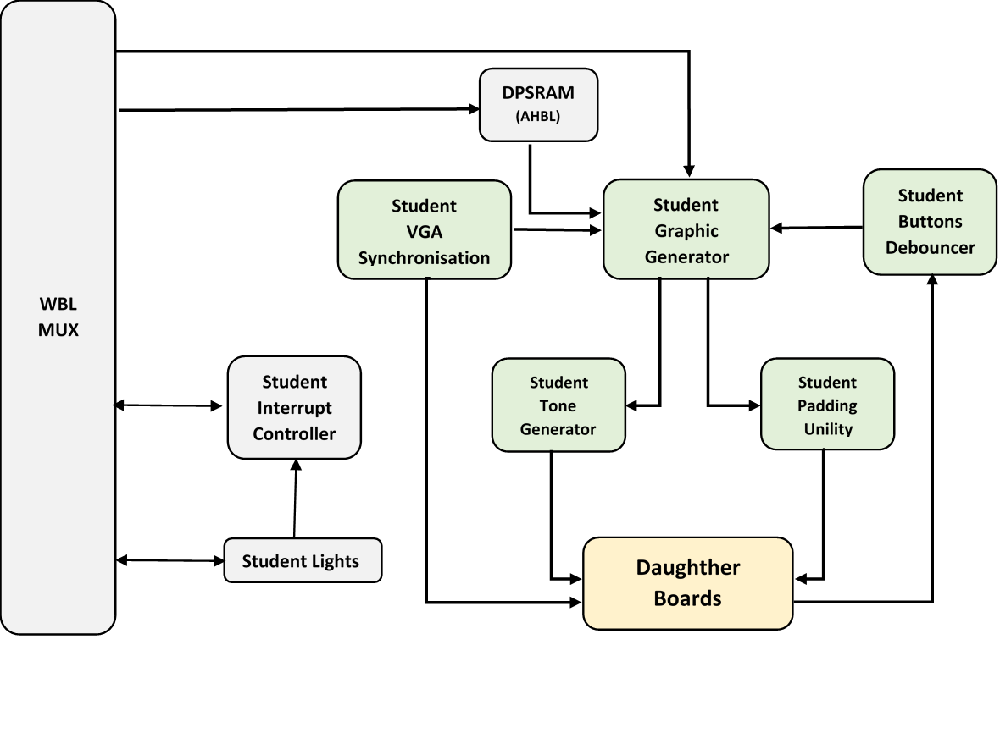

# open source interrupt controller.
This consists of two levels. 
1) First part is bulit on ARMv7 using C code.
2) second part is built using VHDL.

**Notice:**
*the corresponding code is atthaced.

